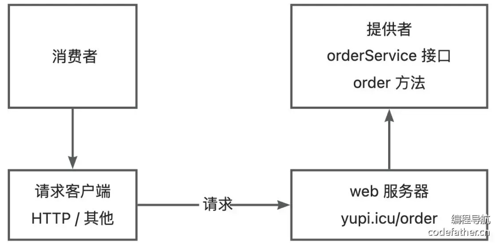
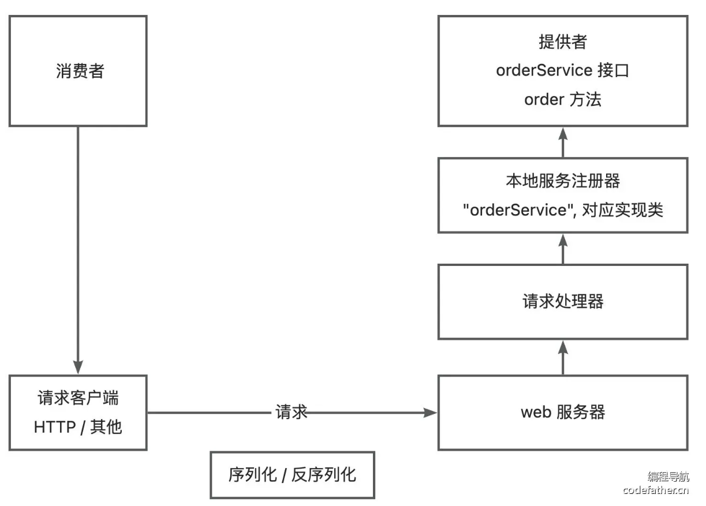
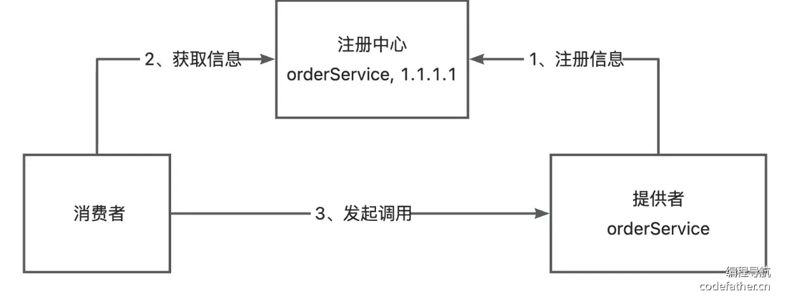
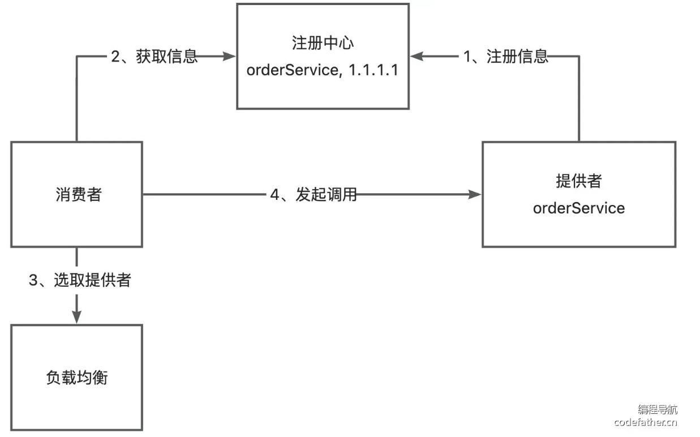
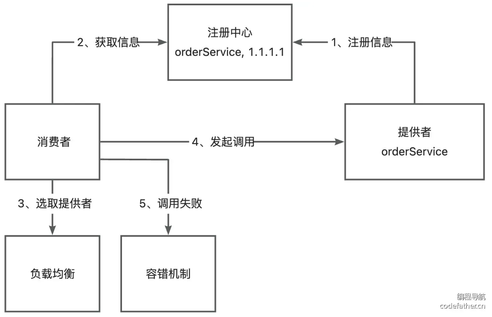
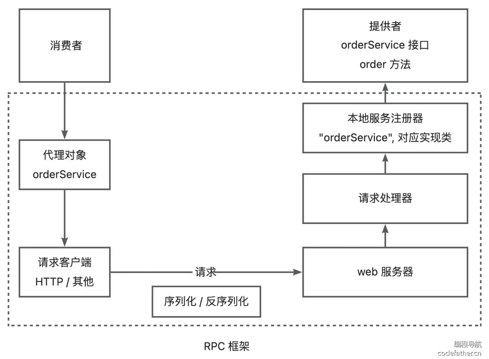

# 简易版RPC框架开发

## 基本设计

* 消费者想要调用提供者，需要提供者启动 web 服务，然后通过请求客户端发送 HTTP 或者其他协议请求调用




* 如果提供者有多个服务和方法，这种单独写接口的方法很臃肿
* 提供一个统一的服务调用接口，通过**请求处理器**，根据客户端请求参数选择不同服务类和方法
* 可以在服务提供者维护一个**本地服务注册器**，记录服务和实现类的映射
* Java 对象无法直接进行网络传输，需要进行序列化/反序列化



* 简化消费者发送的请求代码，为消费者调用的接口生成一个代理对象，由代理对象完成请求和响应的过程


## 扩展设计

### 服务注册发现

* 消费者如何知道提供者的调用地址？
* 建设一个注册中心，保存服务提供者的地址。消费者调用服务时，从注册中心获取对应服务地址
* 一般使用现成第三方服务中心



### 负载均衡

* 有多个服务提供者，消费者如何决定调用哪个？
* 给服务调用方增加负载均衡能力，通过算法选择调用哪个，如轮询、随机、根据性能动态调整



### 容错机制

* 服务调用失败如何处理
* 添加容错机制，比如失败重试、降级调用等



### 其他

* 服务提供者下线：失效节点剔除
* 消费者每次都从注册中心获取信息：使用缓存优化性能
* 优化RPC传输通讯性能
* 可扩展性

# 简易版RPC框架开发

该版本架构设计图：



# 简易版 RPC 框架

## 代码结构

```bash
code
├── example-common              	# 公共模块：定义服务接口和模型
│   ├── pom.xml
│   └── src/main/java/com/code
│       ├── model
│       │   └── User.java       	# 用户模型对象
│       └── service
│           └── UserService.java 	# 服务接口定义
├── example-consumer            	# 消费者示例：调用远程服务
│   ├── pom.xml
│   └── src/main/java/com/code/consumer
│       └── EasyConsumerExample.java 	# 消费者启动类（使用动态代理调用）
├── example-provider            	# 提供者示例：提供服务实现
│   ├── pom.xml
│   └── src/main/java/com/code/provider
│       ├── EasyProviderExample.java 	# 提供者启动类（注册服务并启动 Web 服务）
│       └── UserServiceImpl.java    	# 服务接口的具体实现类
└── ycc-easy-rpc                	# RPC 框架核心核心模块
    ├── pom.xml
    └── src/main/java/com/code
        ├── model
        │   ├── RpcRequest.java     	# RPC 请求封装类
        │   └── RpcResponse.java    	# RPC 响应封装类
        ├── proxy
        │   ├── ServiceProxy.java   	# JDK 动态代理类：封装请求、发送网络请求
        │   └── ServiceProxyFactory.java # 代理工厂：用于创建代理对象
        ├── registry
        │   └── LocalRegistry.java  	# 本地服务注册器：维护服务名与实现类的映射
        ├── serializer
        │   ├── Serializer.java     	# 序列化接口
        │   └── JdkSerializer.java  	# JDK 序列化实现类
        └── server
            ├── HttpServer.java     	# HTTP 服务器接口
            ├── HttpServerHandler.java  # HTTP 请求处理器：处理 RPC 请求并调用本地服务
            └── VertxHttpServer.java  	# 基于 Vert.x 实现的 HTTP 服务器
```

## 数据流程

以下是数据从消费者（Consumer）流向提供者（Provider）并返回的完整链路：

### 1. 服务提供者初始化 (Provider Side)

1. **服务注册**：
   - **文件**：`EasyProviderExample.java` -> `main` 函数
   - **动作**：调用 `LocalRegistry.register(serviceName, implClass)`。
   - **位置**：`LocalRegistry.java` -> `register` 函数，将服务名与实现类存入 `ConcurrentHashMap`。
2. **启动 Web 服务**：
   - **文件**：`EasyProviderExample.java` -> `main` 函数
   - **动作**：调用 `VertxHttpServer.doStart(port)`。
   - **内部**：Vert.x 启动监听，绑定 `HttpServerHandler` 处理请求。

---

### 2. 服务消费者发起调用 (Consumer Side)

3. **获取代理对象**：
   - **文件**：`EasyConsumerExample.java` -> `main` 函数
   - **动作**：调用 `ServiceProxyFactory.getProxy(UserService.class)`。
   - **位置**：`ServiceProxyFactory.java` -> `getProxy` 函数，使用 JDK 动态代理创建并返回 `ServiceProxy` 实例。
4. **执行方法调用**：
   - **文件**：`EasyConsumerExample.java` -> `main` 函数
   - **动作**：执行 `userService.getUser(user)`。此时会跳转到代理类的逻辑。

---

### 3. 请求封装与发送 (Consumer Side -> Network)

5. **代理拦截与请求构造**：
   - **文件**：`ServiceProxy.java` -> `invoke` 函数
   - **动作**：
     - 将调用的方法名、参数等封装进 `RpcRequest` 对象。
     - 调用 `JdkSerializer.serialize(rpcRequest)` 将对象转为字节数组。
6. **网络传输（发送）**：
   - **文件**：`ServiceProxy.java` -> `invoke` 函数
   - **动作**：使用 Hutool 的 `HttpRequest.post` 发送二进制数据到 `localhost:8080`。

---

### 4. 服务端接收与执行 (Provider Side)

7. **接收请求并反序列化**：
   - **文件**：`HttpServerHandler.java` -> `handle` 函数
   - **动作**：
     - 通过 `request.bodyHandler` 获取请求体字节码。
     - 调用 `JdkSerializer.deserialize(bytes, RpcRequest.class)` 还原成 `RpcRequest` 对象。
8. **反射调用具体实现**：
   - **文件**：`HttpServerHandler.java` -> `handle` 函数
   - **动作**：
     - 从 `LocalRegistry.get(request.getServiceName())` 获取实现类 `UserServiceImpl`。
     - 通过 `implClass.getMethod(...)` 找到方法。
     - 执行 `method.invoke(newInstance, args)` 得到结果（如 `User` 对象）。

---

### 5. 结果返回与响应 (Provider Side -> Consumer)

9. **响应封装与序列化**：
   - **文件**：`HttpServerHandler.java` -> `doResponse` 函数
   - **动作**：
     - 将结果封装进 `RpcResponse`。
     - 调用 `JdkSerializer.serialize(rpcResponse)`。
     - 通过 `HttpServerResponse.end(buffer)` 发回字节数据。
10. **消费者接收并还原**：
    - **文件**：`ServiceProxy.java` -> `invoke` 函数
    - **动作**：
      - 接收 HTTP 响应字节码。
      - 调用 `JdkSerializer.deserialize(bytes, RpcResponse.class)`。
      - 返回 `rpcResponse.getData()`。

---

### 6. 最终完成

11. **结果呈现**：
    - **文件**：`EasyConsumerExample.java`
    - **动作**：拿到代理返回的 `User` 对象，执行 `System.out.println(NewUser.getName())`。
