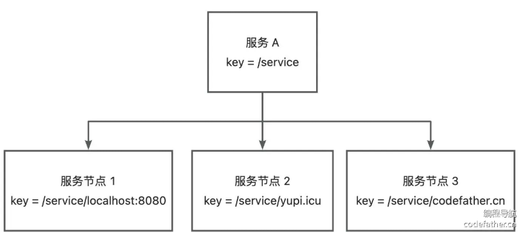
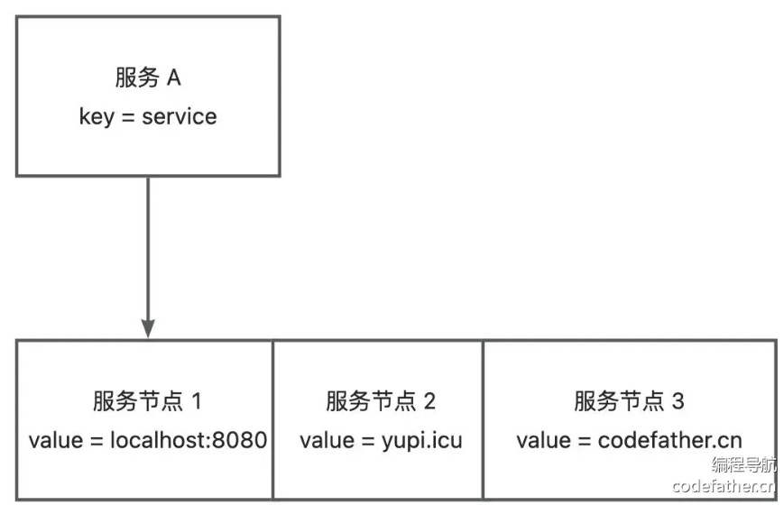

# 注册中心基本实现

注册中心：帮助服务消费者获取到服务提供者的调用地址，而不是将地址硬编码

## 设计方案

### 注册中心核心能力

* 数据分布式存储：集中注册信息的数据存储、读取和共享
* 服务注册：服务提供者上报服务信息到注册中心
* 服务发现：服务消费者从注册中心拉取服务信息
* 心跳检测：定期检查服务的存活状态
* 服务注销：手动剔除节点或者自动剔除失效节点

## Etcd入门

* Go 语言实现的、开源的、分布式的键值存储系统
* 核心数据结构：
  * **Key（键）** ：Etcd 中的基本数据单元，类似于文件系统中的文件名。每个键都唯一标识一个值，并且可以包含子键，形成类似于路径的层次结构。
  * **Value（值）** ：与键关联的数据，可以是任意类型的数据，通常是字符串形式。
* 重要特性
  * **Lease（租约）** ：用于对键值对进行 TTL 超时设置，即设置键值对的过期时间。当租约过期时，相关的键值对将被自动删除。
  * **Watch（监听）** ：可以监视特定键的变化，当键的值发生变化时，会触发相应的通知。
* Java 客户端
  * **kvClient** ：用于对 etcd 中的键值对进行操作。通过 kvClient 可以进行设置值、获取值、删除值、列出目录等操作。
  * **leaseClient** ：用于管理 etcd 的租约机制。租约是 etcd 中的一种时间片，用于为键值对分配生存时间，并在租约到期时自动删除相关的键值对。通过 leaseClient 可以创建、获取、续约和撤销租约。
  * **watchClient** ：用于监视 etcd 中键的变化，并在键的值发生变化时接收通知。
* 除了键值，还存在版本、创建版本、修改版本字段。因为 etcd 中的每个键都有一个与之关联的版本号，用于跟踪键的修改历史。当一个键的值发生变化时，其版本号也会增加。
* 通过使用 etcd 的 Watch API，可以监视键的变化，并在发生变化时接收通知。这种版本机制使得 etcd 在分布式系统中能够实现乐观并发控制、一致性和可靠性的数据访问。

## 存储结构设计

* 服务中心如何存储在注册中心内？
  * key 如何设计
  * value 如何设计
  * key 什么时候过期
* 层级结构
  * 服务器：文件夹
  * 节点：文件夹下的文件
  * 查询方式：服务名称，前缀查询。`业务前缀/服务名称/服务节点地址`
  * 
* 列表结构
  * 
* Etcd支持层级查询，选择第一种；Redis支持列表数据结构，用第二种

## 开发实现

### 注册中心开发

#### 注册中心定义

* 新建 `ServiceMetaInfo` 类，封装服务注册信息：服务名称、版本号、服务地址（域名+端口号）、服务分组等
* 添加工具方法，获取服务注册键名、服务节点名等
* 给 `RpcRequest` 对象补充服务版本号字段
* 给 `RpcConstant` 补充默认服务版本常量，在 `RpcRequest` 中使用该常量

#### 注册中心配置

* 新建注册中心配置类 `RegistryConfig` ，让用户配置连接注册中心所需的信息。如注册中心类别、注册中心地址、用户名、密码、连接超时时间等
* 为 `RpcConfig` 全局配置补充注册中心配置

#### 注册中心接口

* 新建接口 `Registry` ，提供初始化、注册服务、服务发现、注销服务、服务销毁等方法

#### Etcd 注册中心实现

* 新建实现类 `EtcdRegistry` ，实现注册中心接口

### 支持配置和扩展注册中心

* 开发者能够填写配置指定使用的注册中心，并支持自定义注册中心
* 使用工厂创建对象、使用 SPI 动态加载自定义注册中心
* 新建 `RegistryKeys` 类，列举支持的注册中心键名
* 新建 `RegistryFacotry` 类，支持根据 key 从 SPI 获取注册中心对象实例
* 编写 SPI 配置文件
* 初始化注册中心，服务提供者和服务消费者都需要注册中心建立连接

### 完成调用流程

* 修改服务消费者调用服务的代码
* 从注册中心获取节点信息，在得到调用地址并执行
*
