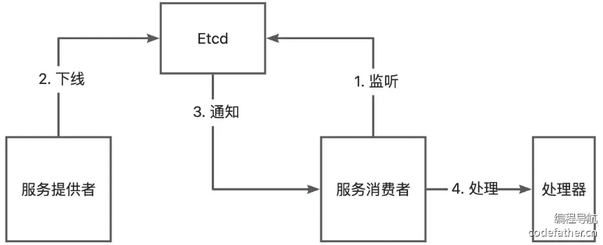

# 注册中心优化

* 当前注册中心存在的问题：
  * **数据一致性** ：服务提供者如果下线了，注册中心需要即时更新，剔除下线节点。否则消费者可能会调用到已经下线的节点。
  * **性能优化** ：服务消费者每次都需要从注册中心获取服务，可以使用缓存进行优化。
  * **高可用性** ：保证注册中心本身不会宕机。
  * **可扩展性** ：实现更多其他种类的注册中心。
* 优化点
  * 心跳检测和续期机制
  * 服务节点下线机制
  * 消费端服务缓存
  * 基于 ZooKeeper 的注册中心实现

## 心跳检测和续期机制

### 设计方案

* 用于检测系统是否正常工作，通过定期发送 心跳信号（请求） 检测目标系统状态
* 实现关键：定期、网络请求
* 使用 Etcd 实现
  * 服务提供者向 Etcd 注册自己的服务信息，并在注册时设置 TTL（生存时间）。
  * Etcd 在接收到服务提供者的注册信息后，会自动维护服务信息的 TTL，并在 TTL 过期时删除该服务信息。
  * 服务提供者定期请求 Etcd 续签自己的注册信息，重写 TTL。
  * 续期时间一定要小于过期时间，允许一次容错的机会。
* 在服务提供者本地维护一个  **已注册节点集合** ，注册时添加节点 key 到集合中，只需要续期集合内的 key 即可。

### 开发实现

* 给 `Registry` 接口补充心跳检测 `heartBeat` 方法
* 在实现类 `EtcdRegistry` 中
  * 定义一个本机注册的节点 key 集合，用于维护续期
  * 在服务注册和注销时，添加/移除节点
  * 实现 `heartBeat` 方法
  * 在 `init` 方法中启用心跳检测
* 完善测试类代码

## 服务节点下线机制

* 服务提供者节点宕机时，需要从注册中心移除已注册的节点，否则会影响消费者端调用

### 设计方案

* 服务节点下线分为：
  * **主动下线** ：服务提供者项目正常退出时，主动从注册中心移除注册信息。
  * **被动下线** ：服务提供者项目异常推出时，利用 Etcd 的 key 过期机制自动移除。
* 被动下线已经可以利用 Etcd 的机制实现了，我们主要开发主动下线。利用 JVM 的 `ShutdownHook` 就能实现。
* JVM 的 `ShutdownHook` 是 Java 虚拟机提供的一种机制，允许开发者在 JVM 即将关闭之前执行一些清理工作或其他必要的操作，例如关闭数据库连接、释放资源、保存临时数据等。

### 开发实现

* 完善 `EtcdRegistry` 的 `destroy` 方法，补充下线节点逻辑
* 在 `RpcApplication` init 方法中注册 ShutDown Hook，程序退出时执行注册中心的 `destory` 方法

## 消费者服务缓存

* 正常情况下，服务节点信息列表的更新频率是不高的，所以在服务消费者从注册中心获取到服务节点信息列表后，可以缓存**在本地** 

### 增加本地缓存

* 暂时只考虑但服务缓存
* 使用列表存储服务信息，提供操作列表的基本方法：读写缓存、清空缓存
* 开发实现
  * 新增  `RegistryServiceCache` 类

### 使用本地缓存

* 修改 `EtcdRegistry` 类，使用缓存对象
* 修改服务发现逻辑，优先从缓存获取服务，如果没有则从注册中心获取

### 服务缓存更新 - 监听机制

* 当服务注册信息发生变更（比如节点下线）时，需要即时更新消费端缓存。
* 使用 Etcd 的 watch 监听机制，当监听的某个 key 发生修改或删除时，就会触发事件来通知监听者。
* 缓存是在服务消费者端维护和使用的，服务消费者去 watch
* 在服务发现方法（`serviceDiscovery`）。可以对本次获取到的所有服务节点 key 进行监听。
* 还需要防止重复监听同一个 key，可以通过定义一个已监听 key 的集合来实现。
* 开发实现
  * 给 `Registry` 接口补充监听 key 的方法
  * 给  `EtcdRegistry` 类增加监听 key 的结合，并实现监听方法
  * 在消费端获取服务时调用 `watch` 方法

## 扩展

* 完善服务注册信息：比如增加节点注册时间。
* 实现更多注册中心（较难）：使用 Redis 实现注册中心。
* 保证注册中心的高可用：了解 Etcd 的集群机制。
* 服务注册信息失效的兜底策略（较难）：如果消费端调用节点时发现节点失效，也可以考虑是否需要从注册中心更新服务注册信息、或者强制更新本地缓存。
* 注册中心 key 监听时，采用观察者模式实现处理：可以定义一个 Listener 接口，根据 watch key 的变更类型去调用 Listener 的不同方法。
