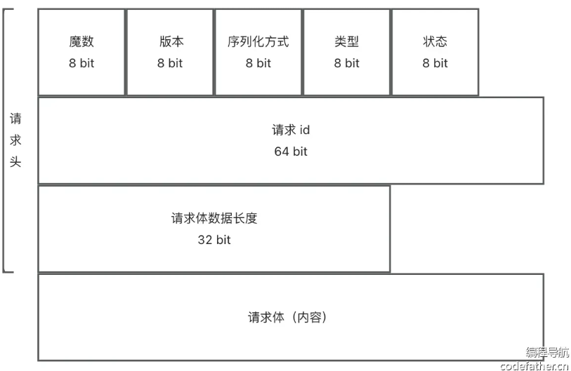
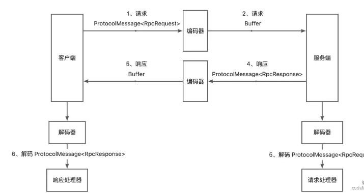

# 自定义协议

## 需求分析

* 目前使用的是HTTP 协议
* RPC 比较注重性能，HTTP 的头部消息比较重

## 设计方案

### 网络传输设计

* HTTP 头请求消息大 + 无状态
* 使用 TCP 协议

### 消息结构设计

* Java 实现位运算拼接相对麻烦，因此设计是尽量将数据凑到整个字节
* RPC 消息所需的信息：
  * 魔法数字：安全校验
  * 版本号：保证请求和响应的一致性
  * 序列化方式：如何解析数据
  * 类型：标识请求/响应、或心跳检测等
  * 状态（HTTP 状态码）
  * 请求 id：标识唯一性
  * 请求体：发送数据
  * 请求体消息长度（TCP 粘包问题）

### Dubbo 的协议设计

* 16 字节请求头 + 请求体

| 字节  | 含义             |
| ----- | ---------------- |
| 0-1   | 魔法数字         |
| 2     | 标志位           |
| 3     | 状态（仅响应有） |
| 4-11  | 请求 ID          |
| 12-15 | Body 长度        |

* 标志位设计

| bit位 | 功能               |
| ----- | ------------------ |
| 7     | 请求 / 响应        |
| 6     | 是否双向           |
| 5     | 是否是事件（心跳） |
| 4-0   | 序列化方式         |

## 开发实现

### 消息结构

* 新建协议消息类  `ProtocolMessage`
* 新建协议常量类  `ProtocolConstant`
* 新建消息字段枚举类 `ProtocolMessageStatusEnum` ，暂时定义成功、请求失败、响应失败三种
* 新建协议消息类型枚举类 `ProtocolMessageTypeEnum`，包括请求、响应、心跳、其他类
* 新建消息序列化器枚举类 `ProtocolMessageSerializerEnum`，和当前项目支持的序列化器对应

### 网络传输

* Vert.x 支持 TCP 服务器
* 新建 `VertxTcpServer` 类，创建服务器实例，定义处理请求的方法，启动服务器
* 新建类，创建客户端实例，定义处理请求的方法，并建立连接

### 编码/解码器

* Vert.x 的 TCP 服务器发送的消息是 Buffer 类型，不能直接写入对象，需要编码和解码，将 Java 消息对象和 Buffer 进行相互转换
* 
* 新建 `ProtocolMessageEncoder` 消息编码器类，向 Buffer 缓冲区写入消息对象
* 新建 消息解码器类，从 Buffer 缓冲区读取字段构造出完整的消息对象

### 请求处理器（服务提供者）

* 使用 Netty 的 pipeline 组合多个 handler
* 开发 `TcpServerHandler`，实现 Vert.x 的 `Handler<NetSocket>` 请求，用于处理请求

### 请求发送（服务消费者）

* 调整服务消费者的代码，将 HTTP 请求改为 TCP 请求

## 粘包半包问题

* 连续发送消息
  * 半包：每次收到的数据更少了
  * 粘包：每次收到的数据更多了

### 解决半包

* 在消息头中设置请求体长度，服务端接受时判断消息长度是否符合预期，不完整就不读，留到下一次就收消息再读

### 解决粘包

* 每次只读取指定长度数据，超过长度的留着下一次读取

### Vert.x 解决粘包半包

* 使用内置 `RecordParser` ，其作用是保证下次读取到特定长度的字符
* 实际情况中消息体长度并不固定
  * 请求头长度固定，先读取请求头信息
  * 根据请求头信息更改 `RecordParser` 的固定长度

### 封装粘包半包处理器

* 使用装饰着模式，利用 `RecordParser`  对原有 Buffer  处理器的能力进行增强
* 新建 类，实现并增强 `Handler<Buffer>` 接口
*
