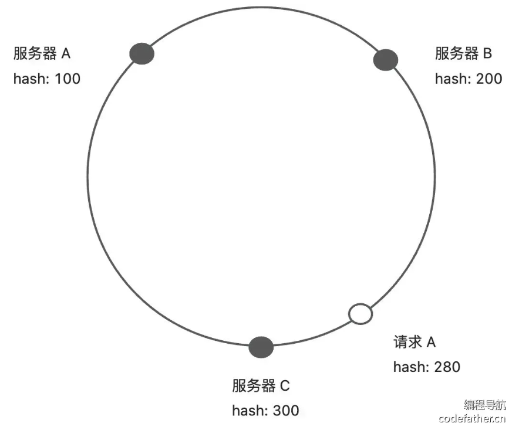
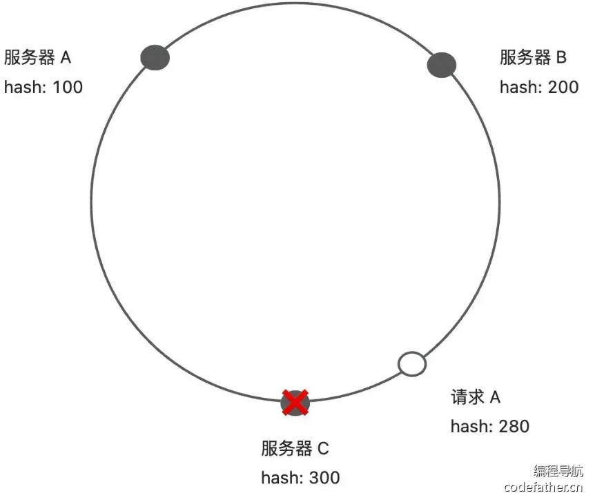

# 负载均衡

## 需求分析

* 目前消费者始终读取了第一个服务提供者节点发起调用，节点压力大
* 从服务提供者节点中，选择一个服务提供者发起请求，而不是每次都请求同一个服务提供者

## 负载均衡算法

| 算法       | 描述                         | 适用场景                 |
| ---------- | ---------------------------- | ------------------------ |
| 轮询       | 循环将请求分给各服务器       | 服务器性能相近           |
| 随机       |                              | 服务器性能相近且负载均衡 |
| 加权       | 根据服务器性能或权重分配请求 | 服务器性能不均           |
| 加权随机   | 根据服务器权重随机选择       | 服务器性能不均           |
| 最小连接数 | 选择当前连接数量最少的服务器 | 长连接场景               |
| IP Hash    | 根据客户端 IP 地址选择服务器 | 需要保持会话一致性       |

## 一致性 Hash

* 将整个哈希值空间划分成一个环状结构，每个节点或服务器在环上占据一个位置，每个请求根据其哈希值映射到环上的一个点，然后顺时针寻找第一个大于或等于该哈希值的节点，将请求路由到该节点上。
* 下图中请求 A 会交给服务器 C 处理

* 节点下线：某个节点下线时，其负载会被均分到其他节点上，而不会影响整个系统稳定性，下图中服务器 C 下线，请求 A 由服务器 A 处理
* 
* 倾斜问题：引入虚拟节点，将物理节点映射到多个虚拟节点上面，使节点在哈希环的分布更加均匀

## 开发实现

### 实现负载均衡器

* 新建负载均衡器接口 `LoadBalancer`，提供选择服务方法，接受请求参数和可用服务列表
* 新建轮询负载均衡器 `RoundRobinLoadBalancer`，使用 JUC 包的 `AtomicInteger` 实现原子计数器，防止并发问题
* 新建随机负载均衡器，使用 `Random` 实现随机选取
* 实现一致性哈希负载均衡器，使用 `TreeMap` 实现哈希环

### 配置和扩展负载均衡器

* 新建 `LoadBalancerKeys` 类，列举支持的负载均衡器名称
* 新建 `LoadBalancerFactory` 工厂类，支持根据 key 从 SPI 获取负载均衡器对象实例
* 编写负载均衡器接口的的 SPI 配置文件
* 为 `RpcConfig` 新增负载均衡器的配置

### 应用负载均衡器

* 修改 `ServiceProxy` ，将“固定调用第一个服务节点”改为“调用负载均衡器第一个服务节点”
